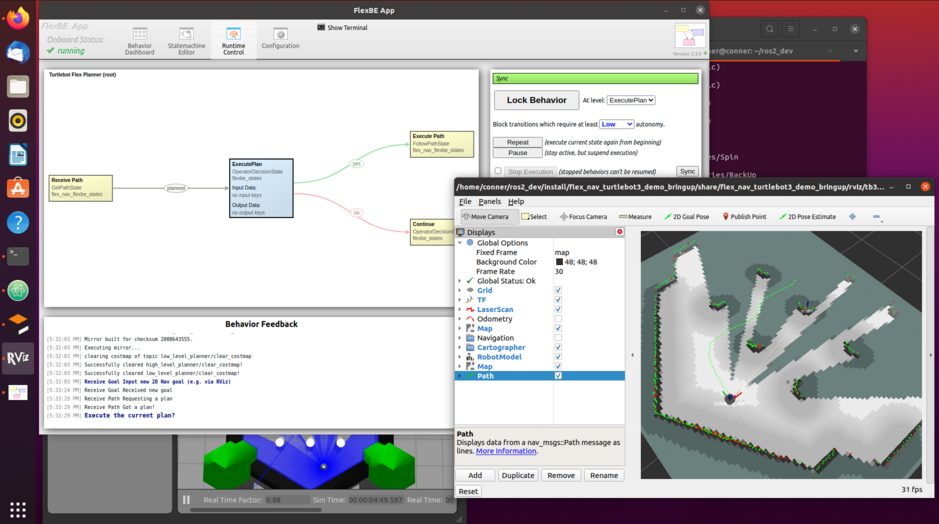

Flex Nav Turtlebot3 Demo
================================

## Introduction

Custom behaviors and launch files for demonstrations of the [ROS 2] and [FlexBE]-based [Flexible Navigation] ([Wiki]) for use with the ROBOTIS-based Turtlebot.

This repository contains code that interfaces with the ROS 2 versions of the [ROBOTIS Turtlebot3] models, the [FlexBE Behavior Engine], [FlexBE App], and the [Flexible Navigation] system.

Installation and Setup
----------------------

This package has a number of dependencies.  

The quickest and easiest method to get a demonstration up and running is to follow the instructions below.

1) Ensure that you are running a recent ROS 2 version

  * This system is tested on `ros-humble-desktop` on Ubuntu 22.04
  * See [ROS 2 Installation] for more information.
  * Make sure the `colcon` build and `rosdep` tools are installed

2) The [ROBOTIS Turtlebot3] packages (standard ROS install) are required
  * You may install manually or depend on `rosdep`

3) Clone the required repositories into a ROS 2 workspace
  * This repo
  * [FlexBE App]
  * [FlexBE Behavior Engine]
  * [Flexible Navigation]

    > NOTE: If official ROS 2 release versions are available, then you may use those.
    > As of this update, they are NOT yet available for `apt install`.

 > NOTE: If you are using the ROS wstools, you may add the following to your `.rosinstall` file, and then do `wstool merge` and `wstool update`.

     - git: {local-name: src/flex_nav_turtlebot3_demo, uri: 'https://github.com/FlexBE/flex_nav_turtlebot3_demo.git', version: ros2-devel-alpha }
     - git: {local-name: src/flexbe_app,               uri: 'https://github.com/FlexBE/flexbe_app.git',               version: ros2-devel-alpha }
     - git: {local-name: src/flexbe_behavior_engine,   uri: 'https://github.com/FlexBE/flexbe_behavior_engine.git',   version: ros2-devel-alpha }
     - git: {local-name: src/flexible_navigation,      uri: 'https://github.com/FlexBE/flexible_navigation.git',      version: ros2-devel-alpha }

4) Install any required dependencies.

    rosdep update  
    rosdep install -r --from-paths . --ignore-src

6) Build your workspace:

    colcon build

7) Install required `nwjs` binaries for FlexBE

    After building with `colcon` and sourcing the new `setup.bash` as normally required, you must
    download the required `nwjs` binaries *before* you can run the FlexBE App:

    `ros2 run flexbe_app nwjs_install`

  > Note: These are installed in the `install` folder.  If the `install` folder is deleted, then the `nwjs` binaries
  will need to be reinstalled with this script.

## Operation
---------

> NOTE: In 29-June-2022 Humble release, an issue with Navigation 2 results in an
> empty local costmap. As a fix, you can change the default DDS provider.  
> We added the following lines to our setup.bash

    <pre>
    # Dealing with github.com/navigation2 #2489 and PR #3018
    echo "Changing default DDS to Cyclone due to Nav 2 issue!"
    export RMW_IMPLEMENTATION=rmw_cyclonedds_cpp
    </pre>

The following directions are for a simple demonstration of Flexible Navigation using [ROS 2 Cartographer] as the map.

### Start the simulated robot
`export TURTLEBOT3_MODEL=burger`
 * This defines which version of the Turtlebot3 will be simulated
 * We suggest you add this line to your `setup.bash` or `~/.bashrc` file.
   * Otherwise, you will need export the `TURTLEBOT3_MODEL` variable for each terminal below.

`ros2 launch turtlebot3_gazebo turtlebot3_world.launch.py`
 * Starts the simulated environment of the ROBOTIS Turtlebot3 world with the simulated Turtlebot3

### Start map server
 With an unknown map, ROS 2 Cartographer will build a map of the simulated environment

 `ros2 launch flex_nav_turtlebot3_demo_bringup cartographer.launch.py use_sim_time:=True`

  * This is a custom version based on `turtlebot3_cartographer`
  * Starts ROS 2 Cartographer to build a map
  * Sets use_sim_time to true instead of the robot running in real time
  * Again, be sure `TURTLEBOT3_MODEL` is set!

### Visualization

 RViz is started alongside ROS 2 Cartographer with the previous command

 Displays a standard view of transforms of Turtlebot3, sensor data, with maps, and paths displayed

 This custom version adds the follow robot model, path, and global cost map to the default cartographer setup.

  * A `Path` to the RViz display and set the topic to `/high_level_planner/plan`
  * A `RobotModel` (uses the `/robot_description` topic)
  * A `Map` showing the topic `/global_costmap/costmap`
  * The `2D Goal Pose` publishes to the topic `/flex_nav_global/goal`

### Startup of Flexible Navigation

Flexible Navigation requires startup of planning and control nodes, as well as the FlexBE behavior engine and UI.

`ros2 launch flexbe_app flexbe_full.launch.py`

  * This starts the FlexBE behavior engine and FlexBE App UI

Then start one (and only one) of the following launches that starts the planning and control nodes:

 * `ros2 launch flex_nav_turtlebot3_demo_bringup flex.launch`
     * This version uses a 2-level planner as a demonstration.
       * The global planner plans over the full map, with sensor data
       * The local planner plans over smaller window trying to follow the global path

 *or*

 * `ros2 launch flex_nav_turtlebot3_demo_bringup flex_multi_level.launch`
     * This version uses a 3-level planner as a demonstration.
       * The high-level planner is based only on the static map
       * The mid-level planner using only local obstacle sensing
       * The low-level planner using the [ROS 2 Navigation2] DWBLocalPlanner

     *  The mid- and low-level planners run concurrently as they try to follow the global path defined by the high-level planner.

 *or*

 * `ros2 launch flex_nav_turtlebot3_demo_bringup flex_four_level.launch`
     * This version uses a 4-level planner as a demonstration.
       * The high-level planner is based only on the static map
       * The mid-level planner using only local obstacle sensing
       * The low-mid-level planner using only local obstacle sensing
       * The low-level planner using the [ROS 2 Navigation2] DWBLocalPlanner

     *  The mid- and low-level planners run concurrently as they try to follow the global path defined by the high-level planner.

### FlexBE Operation
After startup, all control is through the FlexBE App operator interface and RViz.  

* First load the desired behavior through the `FlexBE Behavior Dashboard` tab.
  * The behavior should match the flex launch started above.
    * 'flex.launch' --> `Turtlebot Flex Planner`
    * 'flex_multi_level.launch' --> `Turtlebot Multi Level Flex Planner`
    * 'flex_four_level.launch' --> `Turtlebot Four-Level Flex Planner`

* Examine (but don't modify yet!) the behavior using the `Statemachine Editor` button on FlexBE app
  * Click on a state to see the configurable parameters

* Execute the behavior via the `FlexBE Runtime Control` tab.
  * Click `Connect` to establish the initial connection between App and Onboard Behavior Engine
  * Then `Start Execution`

* The system requires the operator to input a `2D Nav Goal` via the `RViz` screen
  * If the system is in `low` autonomy or higher, the system will request a global plan as soon as the goal is received
  * If the autonomy level is `off` (default), then the operator will need to confirm receipt of the goal by clicking the `done` transition.

* After requesting a path to the goal, the resulting plan will be visualized in the `RViz` window.  
  * If the system is not in full autonomy mode, the operator must confirm that the system should execute the plan via the `FlexBE UI`  
  * If the operator sets the `Runtime Executive` to `full` autonomy, the plan will automatically be executed.  
  * In less than `full` autonomy, the operator can request a recovery behavior at this point.

  

* Once execution of this plan is complete, `FlexBE` will seek permission to continue planning
  * In `full` autonomy, the system will automatically transition to requesting a new goal
  * In any autonomy level less than `full`, the system will require an operator decision to continue

Whenever a plan is being executed, the `FlexBE` state machine transitions to a concurrent node that uses on-line planners
to refine the plans as the robot moves, and also monitors the Turtlebot bumper status for collision.  
The operator can terminate the execution early by selecting the appropriate transition in the `FlexBE UI`.  
If this low level plan fails, the robot will request permission to initiate a recovery behavior;
in `full` autonomy the system automatically initiates the recovery.

## Publications

Please use the following publications for reference when using Flexible Navigation:

- David C. Conner and Justin Willis, ["Flexible Navigation: Finite state machine-based integrated navigation and control for ROS enabled robots,"](http://dx.doi.org/10.1109/SECON.2017.7925266) SoutheastCon 2017.

- Joshua Zutell, David C. Conner and Philipp Schillinger, ["ROS 2-Based Flexible Behavior Engine for Flexible Navigation ,"](http://dx.doi.org/10.1109/SoutheastCon48659.2022.9764047), SouthEastCon 2022, April 2022.

---

[ROS 2]: https://docs.ros.org/en/foxy/index.html
[FlexBE]: https://flexbe.github.io
[FlexBE App]: https://github.com/FlexBE/flexbe_app
[FlexBE Behavior Engine]: https://github.com/FlexBE/flexbe_behavior_engine
[Flexible Navigation]: https://github.com/FlexBE/flexible_navigation
[Wiki]: http://wiki.ros.org/flexible_navigation
[ROBOTIS Turtlebot3]: https://emanual.robotis.com/docs/en/platform/turtlebot3/overview/
[ROS 2 Cartographer]: https://ros2-industrial-workshop.readthedocs.io/en/latest/_source/navigation/ROS2-Cartographer.html
[ROS 2 Installation]: https://docs.ros.org/en/foxy/Installation.html
[ROS 2 Navigation2]: https://navigation.ros.org/
[ros2_control]:https://control.ros.org/getting_started.html
